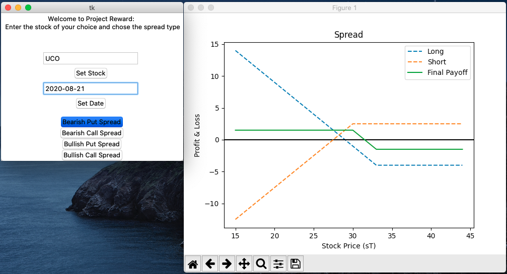
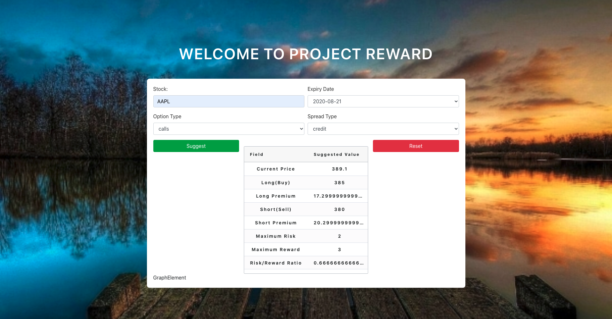

 
 <h2 align="center">Project Reward</h2>

 
 
A software to shortlist and find the best options spread available for a given stock and help visualise it using payoff metric graphs. We have considered a lot of factors to make the suggestinos as sensible as possible and also tried to quantify the fair price using Black-Scholes. All data used is from Yahoo Finance.

As of now this project consists of the basic Bear and Bull spreads with calls and puts but we intend to add more complex graphs corssing between calls and puts and also options with different expiry dates.

Spreads we have:
1. Bear (Puts and Calls)
2.  Bull (Puts and Calls) 
 

Spreads we intend to Add:
1. Straddle (Long and Short)
2. Strangle (Long and Short)
3. Box Spreads
4. Butterfly Spreads
5. Calendar Spreads
6. Strips and Straps
 

To keep the siggestions valid, we have implemented the the Black Scholes and the Monte Carlo pricing models to determine the risk neutral price valution (Fair Price) for the option.    
We also intend this to make this a full stack development project, we plan to build a Flask Application and bridge it to a native app by using React Native. Anyone who thinks that they would enjoy developing this project with us, please open an issue or star the repo or submit a pull request, we would love to collaborate and expand the scope of the project. 

We have a very basic GUI setup that prints out our suggestion and shows the payoff Matric Graph

 
We have also set up the primitive stage 1 API and deployed it on a Flask app on a local host.       

We have also built a simple react application for the front end. We took inspiration from many available templates and made what fit our purpose best. We have linked the API to our Frontend it spits out the suggestions. Now we need to print the suggestions in a better way and integrate the payoff metric graph for better visualization.   

Disclaimer - We are not financial experts and we are too learning as we go along. Please use the suggestions from this repo at your own risk.  

